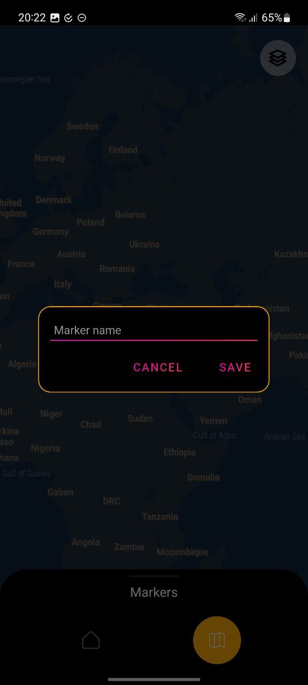

# Space Android App
## Mars Photos
App uses Nasa's API to display photos from Mars in a list. When clicking on a photo, details screen is opened. There user can zoom/move photo like in a gallery app. Also user can share photo with 3rd party apps.

## Map

User can view map of Earth in 3 different views (default, hybrid, satellite). When user clicks on a map the dialog opens up to type marker name. Upon saving marker it will be displayed in bottom sheet dialog that is visible to user but collapsed by default.

---
# Tech stack
- Android SDK
- Clean Architecture
- Moxy MVP
- Cicerone Navigation 
- RxJava3
- Retrofit, OkHttp
- Hilt
- Splash Screen API
- Google Maps SDK
- Firebase Cloud Messaging
- Moshi

# Setup
- Add Firebase's google-services.json to the root directory of app module to be able to send notification from Firebase Console
- Add [NASA_API_KEY](https://api.nasa.gov/) to local.properties
- Add [MAPS_API_KEY](https://developers.google.com/maps) to local.properties

# Screenshots
## Main Screen

## Details Screen

## Map Screen

